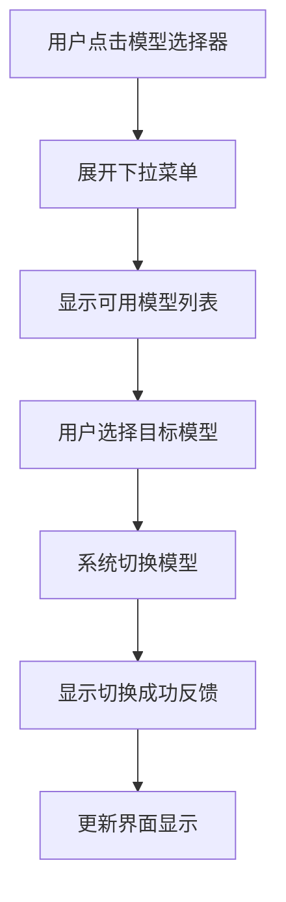

# 模型切换下拉框UI改进需求文档

## 1. 产品概述

本文档旨在改进Vue Chat应用中模型切换下拉框的用户界面设计和交互体验。当前的下拉框设计过于简单，缺乏现代化的视觉效果和良好的用户体验，需要进行全面的UI/UX优化。

## 2. 核心功能

### 2.1 用户角色

| 角色   | 使用场景   | 核心需求                 |
| ---- | ------ | -------------------- |
| 普通用户 | 日常对话交互 | 快速切换AI模型，清晰了解当前使用的模型 |

### 2.2 功能模块

我们的模型切换功能包含以下主要组件：

1. **模型选择器**：下拉框组件，显示可用模型列表
2. **模型标识**：当前选中模型的视觉标识和名称显示
3. **切换反馈**：模型切换后的用户反馈机制

### 2.3 页面详情

| 页面名称 | 模块名称  | 功能描述                                       |
| ---- | ----- | ------------------------------------------ |
| 聊天页面 | 模型选择器 | 提供下拉选择界面，支持模型切换，显示当前选中状态，提供hover和focus交互效果 |
| 聊天页面 | 模型标识  | 清晰显示当前使用的模型名称和特性标识，支持图标展示                  |

## 3. 核心流程

用户在聊天界面中点击模型选择器，展开下拉菜单查看可用模型列表，选择目标模型后系统自动切换并提供反馈确认。



## 4. 用户界面设计

### 4.1 当前问题分析

**现有下拉框存在的主要问题：**

1. **视觉设计单调**

   * 使用原生HTML select元素，样式过于简单

   * 缺乏品牌特色和现代化设计感

   * 与整体界面风格不够协调

2. **交互体验不佳**

   * 下拉选项缺乏视觉层次

   * 没有模型特性说明或图标标识

   * 选中状态不够明显

3. **信息展示不足**

   * 仅显示模型名称，缺乏特性描述

   * 没有模型能力或适用场景的提示

   * 缺乏视觉化的模型区分

### 4.2 设计风格

* **主色调**：保持与现有渐变背景协调的蓝紫色系（#667eea, #764ba2）

* **辅助色**：白色背景 (#ffffff)，深灰色文字 (#333333)

* **按钮样式**：圆角设计（8px），支持悬停和点击状态

* **字体**：系统默认字体，标题14px，描述12px

* **布局风格**：卡片式设计，带阴影效果

* **图标风格**：简洁的线性图标，16px尺寸

### 4.3 页面设计概览

| 页面名称 | 模块名称     | UI元素                                                            |
| ---- | -------- | --------------------------------------------------------------- |
| 聊天页面 | 自定义下拉选择器 | 圆角边框(8px)，白色背景，蓝紫色边框，下拉箭头图标，悬停阴影效果(0 4px 12px rgba(0,0,0,0.15)) |
| 聊天页面 | 模型选项卡片   | 每个选项为独立卡片，包含模型图标、名称、简短描述，选中状态用蓝紫色背景标识                           |
| 聊天页面 | 切换动画     | 0.3s缓动过渡效果，选项展开/收起动画，选中状态渐变动画                                   |

### 4.4 具体改进方案

**1. 替换原生select为自定义组件**

* 使用Vue组件实现自定义下拉框

* 支持完全的样式控制和交互定制

* 添加展开/收起动画效果

**2. 增强视觉设计**

* 添加模型图标（🧠 DeepSeek V3, 🔬 DeepSeek R1）

* 为每个模型添加简短的特性描述

* 使用卡片式布局展示选项

* 添加悬停和选中状态的视觉反馈

**3. 优化交互体验**

* 添加键盘导航支持（上下箭头键）

* 实现点击外部区域关闭下拉框

* 添加搜索过滤功能（如果模型数量增加）

* 提供切换成功的toast提示

**4. 响应式适配**

* 移动端优化：增大点击区域，调整字体大小

* 平板端适配：保持良好的触摸体验

* 桌面端：支持鼠标悬停效果

### 4.5 技术实现要点

**组件结构：**

```
ModelSelector
├── 触发器按钮 (显示当前选中模型)
├── 下拉面板
│   ├── 模型选项列表
│   │   ├── 模型图标
│   │   ├── 模型名称
│   │   └── 模型描述
│   └── 关闭按钮
└── 遮罩层 (点击关闭)
```

**样式特性：**

* 使用CSS Grid或Flexbox布局

* 支持CSS变量主题切换

* 添加过渡动画和微交互

* 确保无障碍访问性（ARIA标签）

### 4.6 响应式设计

产品采用移动优先的响应式设计，在不同设备上提供最佳的触摸和点击体验：

* **移动端（<768px）**：下拉框占据更多屏幕空间，增大触摸目标

* **平板端（768px-1024px）**：保持适中的尺寸和间距

* **桌面端（>1024px）**：支持鼠标悬停效果和键盘导航

## 5. 成功指标

* 用户切换模型的操作时间减少30%

* 用户对界面美观度的满意度提升

* 减少因误操作导致的模型切换错误

* 提升整体产品的专业度和现代感

