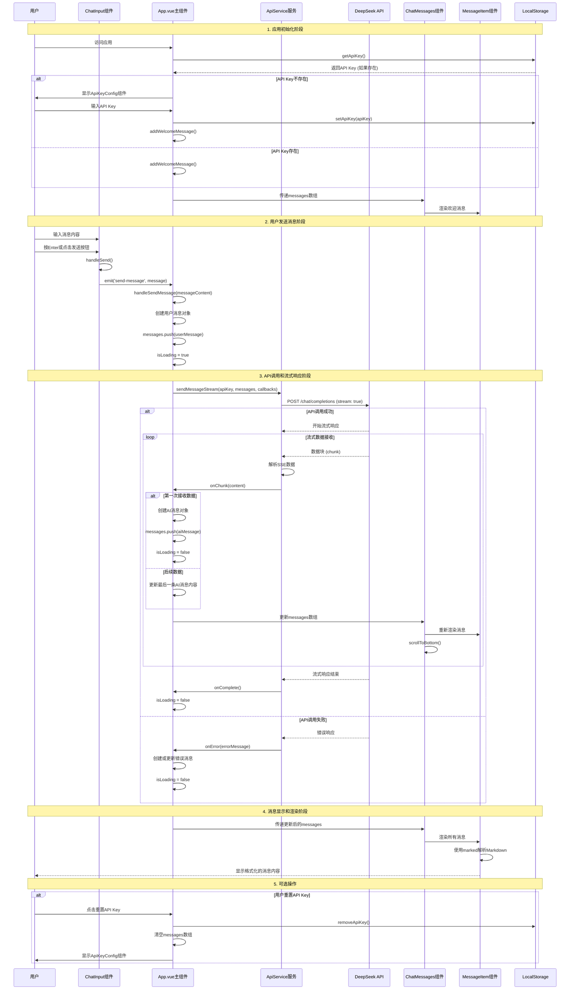

# AI 对话功能时序图

## 系统架构概述

这是一个基于 Vue.js 的 AI 对话应用，使用 DeepSeek API 进行流式对话。

## 时序图

## 关键组件说明

### 1. App.vue (主控制器)

- **职责**: 管理整体状态，协调各组件交互
- **关键状态**:
  - `apiKey`: API 密钥
  - `messages`: 消息历史数组
  - `isLoading`: 加载状态
- **关键方法**:
  - `handleSendMessage()`: 处理用户发送消息
  - `handleApiKeySet()`: 处理 API 密钥设置

### 2. ApiService (API 服务层)

- **职责**: 封装与 DeepSeek API 的交互
- **关键功能**:
  - 流式请求处理
  - 错误处理和重试机制
  - SSE (Server-Sent Events) 数据解析

### 3. ChatInput (输入组件)

- **职责**: 处理用户输入
- **关键功能**:
  - 支持 Enter 发送，Shift+Enter 换行
  - 输入状态管理
  - 发送按钮状态控制

### 4. ChatMessages (消息容器)

- **职责**: 管理消息显示区域
- **关键功能**:
  - 自动滚动到底部
  - 消息列表渲染
  - 加载状态显示

### 5. MessageItem (消息项)

- **职责**: 单条消息的渲染
- **关键功能**:
  - Markdown 内容解析
  - 用户/AI 消息样式区分
  - 头像和布局管理

## 数据流特点

1. **流式响应**: 使用 SSE 实现实时的 AI 回复显示
2. **状态管理**: 通过 Vue 的响应式系统管理消息状态
3. **本地存储**: API Key 持久化存储
4. **错误处理**: 完善的错误处理和用户提示机制
5. **响应式设计**: 支持移动端和桌面端适配

## 技术栈

- **前端框架**: Vue.js 2.x
- **HTTP 客户端**: Fetch API
- **Markdown 解析**: marked.js
- **样式**: CSS3 + 响应式设计
- **存储**: localStorage
- **API**: DeepSeek Chat Completions API
